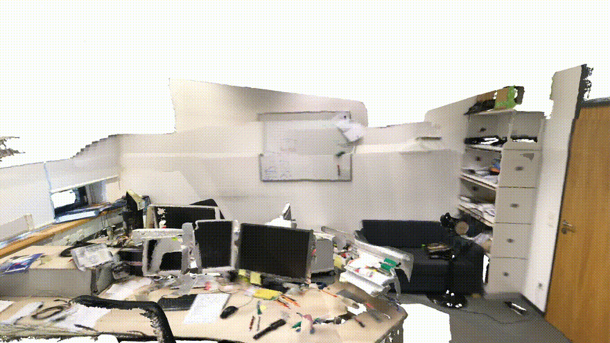
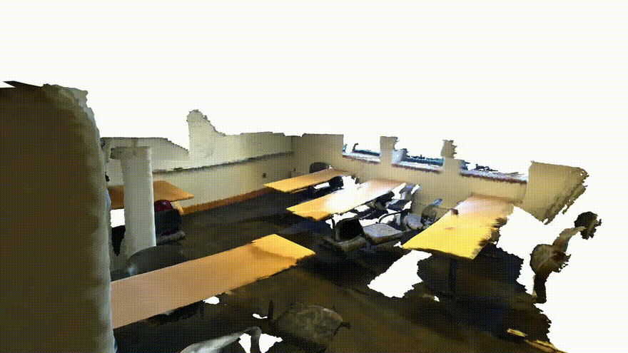
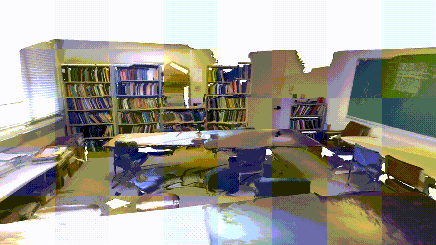
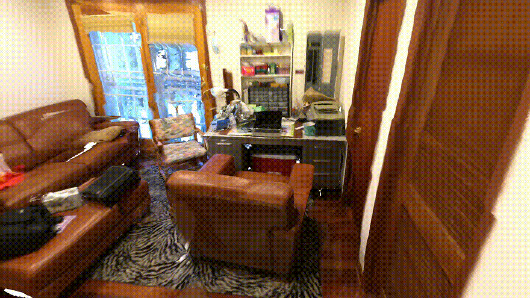
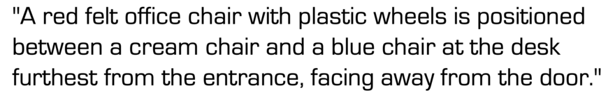
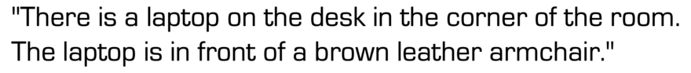
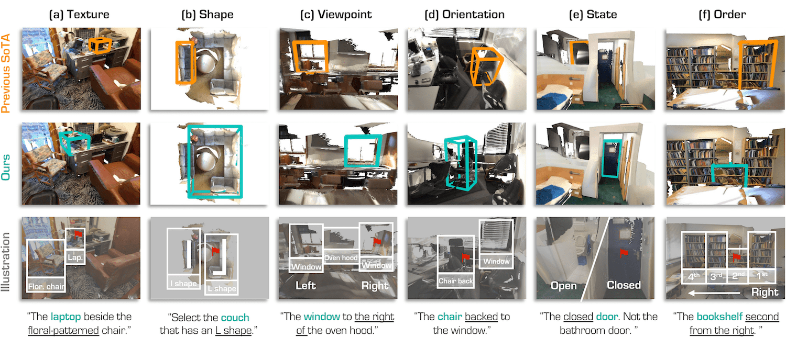
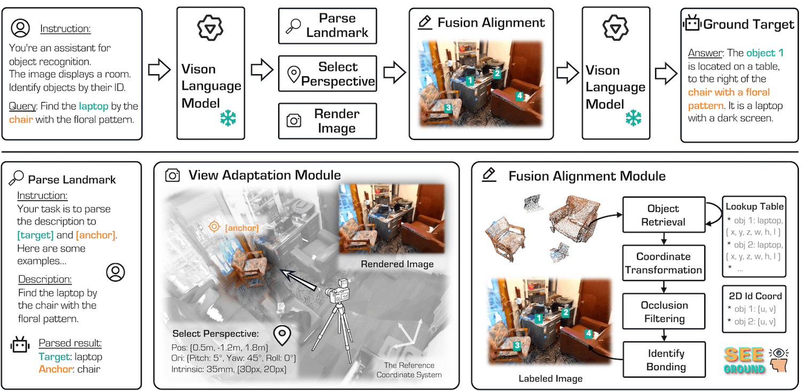

<div align="center">
<h2>Enhancing SeeGround with Relational Depth Text for 3D Visual Grounding</h2>
</div>

- [2025/10]: Manuscript submitted to Sensors, MDPI (SCIE-indexed, Impact Factor: 3.5).

---
## Abstract

3D visual grounding is a core technology that identifies specific objects within complex 3D scenes based on natural language instructions, enhancing human-machine interactions in robotics and augmented reality domains. Traditional approaches have focused on supervised learning reliant on annotated data; however, due to data construction costs and generalization limitations, zero-shot methodologies are emerging, with SeeGround achieving state-of-the-art performance by integrating 2D rendered images and spatial text descriptions. Nevertheless, SeeGround exhibits vulnerabilities in clearly discerning relative depth relationships owing to its implicit depth representations in 2D views. This study proposes the Relational Depth Text technique to overcome these limitations, utilizing a Monocular Depth Estimation model to extract depth maps from rendered 2D images and applying the K-Nearest Neighbors algorithm to convert inter-object relative depth relations into natural language descriptions, thereby incorporating them into VLM prompts. This method distinguishes itself by augmenting spatial reasoning capabilities while preserving SeeGround's existing pipeline, demonstrating a 3.54% improvement in the Acc@0.25 metric on the Nr3D dataset in a 7B VLM environment that is approximately 10.3 times lighter than the original model, along with a 6.74% increase in Unique cases on the ScanRefer dataset, albeit with a 1.70% decline in Multiple cases. The proposed technique enhances the robustness of grounding through viewpoint anchoring and candidate discrimination in complex query scenarios, and is anticipated to expand efficiency in practical applications via future multi-view fusion and conditional execution optimizations.

---

## Keywords
3D Visual Grounding, Vision-Language Models, Zero-Shot Grounding, Open-Vocabulary Learning, Spatial Reasoning, Monocular Depth Estimation, Relational Depth Text, Depth-Aware Grounding

---


### Table 1. Performance comparison on the Nu3D benchmark (Unit: %). Easy/Hard categorizes performance by query difficulty (number of distractors), while Dep./Indep. by viewpoint dependency. Ours HW 7B+Depth represents the performance of the proposed methodology with the Relational Depth Text module, while Ours HW 7B is the lightweight baseline reproduced in our hardware environment. Ori Baseline values are cited from the original SeoGround paper, with 72B serving as an upper-bound reference, and '-' indicating unavailable values.
| Method | Easy | Hard | Dep. | Indep. | Acc@25 | Acc@50 |
|--------|------|------|------|--------|--------|--------|
| Ori Baseline 72B | 54.50 | 38.30 | 42.30 | 48.20 | 46.10 | - |
| Ori Baseline 7B | 40.80 | 26.30 | 31.40 | 34.30 | 33.30 | - |
| Ours HW 7B | 40.99 | 25.97 | 31.35 | 34.17 | 33.18 | 32.88 |
| Ours HW 7B+Depth | 44.39 | 29.65 | 34.59 | 37.87 | 36.72 | 36.34 |

---

### Table 2. Performance comparison on the ScanRefer benchmark (Unit: %). Unique/Multiple categorizes performance by the presence of identical class objects in the scene. The rest of the configuration is the same as in Table 1.
| Method | Unique@25 | Multiple@25 | Unique@50 | Multiple@50 | Acc@25 | Acc@50 |
|--------|-----------|-------------|-----------|-------------|--------|--------|
| Ori Baseline 72B | 75.70 | 34.00 | 68.90 | 30.00 | 44.10 | 39.40 |
| Ori Baseline 7B | - | - | - | - | - | - |
| Ours HW 7B | 64.61 | 28.46 | 60.67 | 26.38 | 37.59 | 35.04 |
| Ours HW 7B+Depth | 71.35 | 26.76 | 65.17 | 23.91 | 38.01 | 34.33 |

---
---

  


<p align="center">  
  <h1 align="center">SeeGround: See and Ground for Zero-Shot Open-Vocabulary 3D Visual Grounding</h1>
</p>

<p align="center">
  <a href="https://rongli.tech/">Rong Li</a><sup>1</sup>&nbsp;&nbsp;&nbsp;&nbsp;
  <a href="https://sj-li.com/">Shijie Li</a><sup>2</sup>&nbsp;&nbsp;&nbsp;&nbsp;
  <a href="https://ldkong.com/">Lingdong Kong</a><sup>3</sup>&nbsp;&nbsp;&nbsp;&nbsp;
  <a href="https://dawdleryang.github.io/">Xulei Yang</a><sup>2</sup>&nbsp;&nbsp;&nbsp;&nbsp;
  <a href="https://junweiliang.me/">Junwei Liang</a><sup>1,4</sup>
  <br/>
  AI Thrust, HKUST(Guangzhou)&nbsp;&nbsp;&nbsp;&nbsp;
  I2R, A*STAR&nbsp;&nbsp;&nbsp;&nbsp;
  National University of Singapore&nbsp;&nbsp;&nbsp;&nbsp;
  CSE, HKUST
</p>

<p align="center">
    <a href='https://arxiv.org/abs/2412.04383'></a>
    <a href='https://seeground.github.io/'></a>
<!--     <a href="https://hits.seeyoufarm.com"></a> -->
</p>

</p>


|||
|----------------------------|----------------------------|
|  |  |
|     |     |
|  |  |
|     |     |

|  |
|:-|
| 3D Visual Grounding (3DVG) aims to locate objects in 3D scenes based on textual descriptions, which is essential for applications like augmented reality and robotics. Traditional 3DVG approaches rely on annotated 3D datasets and predefined object categories, limiting scalability and adaptability. 
| To overcome these limitations, we introduce **SeeGround** :eye:, a zero-shot 3DVG framework leveraging 2D Vision-Language Models (VLMs) trained on large-scale 2D data. We propose to represent 3D scenes as a hybrid of query-aligned rendered images and spatially enriched text descriptions, bridging the gap between 3D data and 2D-VLMs input formats. 
| We propose two modules: the Perspective Adaptation Module, which dynamically selects viewpoints for query-relevant image rendering, and the Fusion Alignment Module, which integrates 2D images with 3D spatial descriptions to enhance object localization. 
| Extensive experiments on ScanRefer and Nr3D demonstrate that our approach outperforms existing zero-shot methods by large margins. Notably, we exceed weakly supervised methods and rival some fully supervised ones, outperforming previous SOTA by 7.7% on ScanRefer and 7.1% on Nr3D, showcasing its effectiveness. |

## :memo: Update
- \[2025.02\] **SeeGround** has been accepted to **CVPR 2025**! 🎉 Huge thanks to our collaborators and the community for the support.
- \[2025.01\] The **code** and **model checkpoints** have been fully released. Feel free to try it out! :hugs:
- \[2024.12\] Introducing **SeeGround** :eye:, a new framework towards zero-shot 3D visual grounding. For more details, kindly refer to our [Project Page](https://seeground.github.io/) and [Preprint](https://arxiv.org/abs/2412.04383). :rocket:


# Table of Content
- [0. Framework Overview](#0-framework-overview)
- [1. Environment Setup](#1-environment-setup)
- [2. Download Model Weights](#2-download-model-weights)
- [3. Download Datasets](#3-download-datasets)
  - [3.1. ScanRefer](#31-scanrefer)
  - [3.2. Nr3D](#32-nr3d)
  - [3.3. Vil3dref Preprocessed Data](#33-vil3dref-preprocessed-data)
- [4. Data Processing](#4-data-processing)
- [5. Inference](#5-inference)
  - [5.1. Deploying VLM Service](#51-deploying-vlm-service)
  - [5.2. Generating Anchors & Targets](#52-generating-anchors--targets)
  - [5.3. Predictions](#53-predictions)
  - [5.4. Evaluations](#54-evaluations)
- [6. Reproduction](#6-reproduction)
- [7. License](#7-license)
- [8. Citation](#8-citation)
- [9. Acknowledgments](#9-acknowledgments)


# 0. Framework Overview
|  |
|:-|
| Overview of the **SeeGround** :eye: framework. 
| We first use a 2D-VLM to interpret the query, identifying both the target object (e.g., "laptop") and a context-providing anchor (e.g., "chair with floral pattern"). A dynamic viewpoint is then selected based on the anchor’s position, enabling the capture of a 2D rendered image that aligns with the query’s spatial requirements. Using the Object Lookup Table (OLT), we retrieve the 3D bounding boxes of relevant objects, project them onto the 2D image, and apply visual prompts to mark visible objects, filtering out occlusions. The image with prompts, along with the spatial descriptions and query, are then input into the 2D-VLM for precise localization of the target object. Finally, the 2D-VLM outputs the target object’s ID, and we retrieve its 3D bounding box from the OLT to provide the final, accurate 3D position in the scene.


# 1. Environment Setup

We recommend using the [official Docker image](https://hub.docker.com/r/qwenllm/qwenvl) for environment setup
```
docker pull qwenllm/qwenvl
```

# 2. Download Model Weights

You can download the qwen2-vl model weights from either of the following sources:
- [huggingface](https://huggingface.co/collections/Qwen/qwen2-vl-66cee7455501d7126940800d) 
- [modelscope](https://modelscope.cn/collections/Qwen2-VL-b4ce472a80274b)


# 3. Download Datasets

## 3.1. ScanRefer 

Download ScanRefer dataset from [official repo](https://github.com/daveredrum/ScanRefer), and place it in the following directory:
```
data/ScanRefer/ScanRefer_filtered_val.json
```

## 3.2. Nr3D 

Download the Nr3D dataset from the [official repo](https://github.com/referit3d/referit3d), and place it in the following directory:

```
data/Nr3D/Nr3D.jsonl
```

## 3.3. Vil3dref Preprocessed Data

Download the preprocessed Vil3dref data from [vil3dref](https://github.com/cshizhe/vil3dref).

The expected structure should look like this:
```
referit3d/
.
├── annotations
|   ├── meta_data
|   │   ├── cat2glove42b.json
|   │   ├── scannetv2-labels.combined.tsv
|   │   └── scannetv2_raw_categories.json
│   └── ...
├── ...
└── scan_data
    ├── ...
    ├── instance_id_to_name
    └── pcd_with_global_alignment
```

# 4. Data Processing

Download [mask3d pred](https://github.com/CurryYuan/ZSVG3D) first.

- ScanRefer 
```
python prepare_data/object_lookup_table_scanrefer.py
```

- Nr3D

```
python prepare_data/process_feat_3d.py

python prepare_data/object_lookup_table_nr3d.py
```

Alternatively, you can download the [preprocessed Object Lookup Table](https://github.com/user-attachments/files/18056532/seeground_object_lookup_table.zip).


# 5. Inference

## 5.1. Deploying VLM Service

We use `vllm` to deploy the VLM. It is recommended to run the following command in a `tmux` session on your server:

```
python -m vllm.entrypoints.openai.api_server --model /your/qwen2-vl-model/path  --served-model-name Qwen2-VL-72B-Instruct --tensor_parallel_size=8
```

The `--tensor_parallel_size` flag controls the number of GPUs required. Adjust it according to your memory resources.

## 5.2. Generating Anchors & Targets

- ScanRefer
```
python parse_query/generate_query_data_scanrefer.py
```

- Nr3D
```
python parse_query/generate_query_data_nr3d.py
```

## 5.3. Predictions

- ScanRefer
```
python inference/inference_scanrefer.py
```

- Nr3D
```
python inference/inference_nr3d.py
```

## 5.4. Evaluations

- ScanRefer 
```
python eval/eval_nr3d.py
```

- Nr3D
```
python eval/eval_scanrefer.py
```

# 6. Reproduction

- [Qwen2-VL-72B results](https://github.com/user-attachments/files/18056533/seeground_results.zip)


# 7. License
This work is released under the Apache 2.0 license.


# 8. Citation 

If you find this work and code repository helpful, please consider starring it and citing the following paper:

```
@inproceedings{li2025seeground,
  title     = {SeeGround: See and Ground for Zero-Shot Open-Vocabulary 3D Visual Grounding},
  author    = {Rong Li and Shijie Li and Lingdong Kong and Xulei Yang and Junwei Liang},
  booktitle = {Proceedings of the IEEE/CVF Conference on Computer Vision and Pattern Recognition (CVPR)},
  year      = {2025},
}
```

# 9. Acknowledgments

We would like to thank the following repositories for their contributions:
- [ZSVG3D](https://github.com/CurryYuan/ZSVG3D)
- [ReferIt3D](https://github.com/referit3d/referit3d)
- [Vil3dref](https://github.com/cshizhe/vil3dref)
- [OpenIns3D](https://github.com/Pointcept/OpenIns3D)
# SeeGround-Relational-Depth
